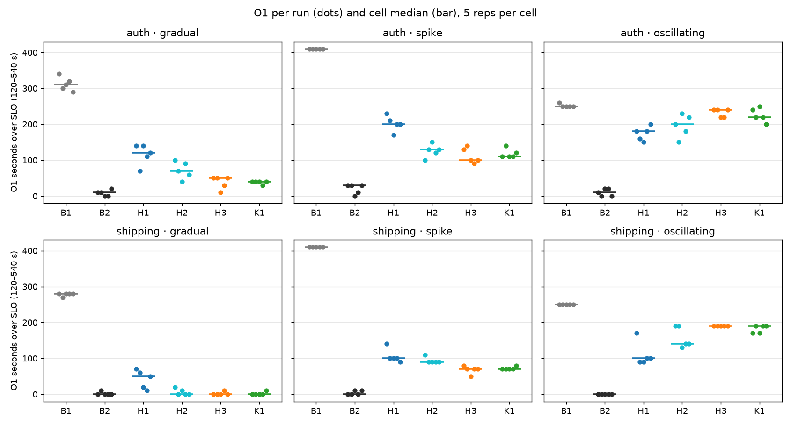
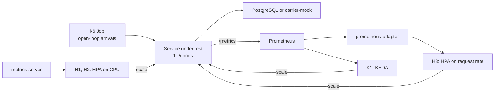

# Kubernetes autoscaling: HPA vs KEDA, CPU vs request rate

[](https://doi.org/10.5281/zenodo.23263354)

Does it matter **which metric** an autoscaler scales on (CPU or request rate), and **which autoscaler** does the scaling
(the Kubernetes HPA or KEDA)? This repository holds a controlled experiment on Azure Kubernetes Service that separates
the two, with every request of every run, the code that produced it, and the analysis.

It is the research for an undergraduate (S1) thesis: *Analisis Pengaruh Jenis Metrik Penskalaan dan Mekanisme
Autoscaler (HPA vs KEDA) terhadap Responsivitas dan Efisiensi Resource Aplikasi Microservices pada Kubernetes*.

## Results

180 runs under a fixed open-loop arrival schedule: 2 services × 6 configurations × 3 load patterns × 5 repetitions.
Medians over 5 runs; p-values from exact rank-sum tests with Holm correction
([full analysis](experiment-results-openloop/analysis/part12/report.md)).

- **Under spike load, request-rate scaling beats CPU scaling** (H2 vs H3 below). Shipping service: 90 vs 70 seconds over the latency SLO
  and 10.64% vs 5.19% failed requests (p = 0.024 each); auth service: 12.50% vs 7.73% failed requests (p = 0.048).
  Request rate starts scaling sooner: first scale-up after 35.2 vs 65.0 s (auth) and 19.7 vs 64.8 s (shipping).
- **HPA and KEDA are indistinguishable.** With the same request-rate metric and threshold, none of the 12 engine tests is
  significant (smallest p = 0.31).
- **Oscillating load defeats every autoscaler.** They close 4.2–29.2% (auth) and 24.0–60.0% (shipping) of the gap
  between 1 and 5 fixed pods, against 55.3–100% under gradual and spike load. Request-rate autoscalers scale back to one
  pod in every trough and meet each new peak on it.
- **CPU-based scaling repeats worse.** The run-to-run spread of seconds over SLO is larger for CPU-based configurations
  (median range 60 vs 20 s per cell, p = 0.0004). The HPA's CPU reading changed only about once a minute on this
  cluster, and all 23 scale-downs during a load peak came from the tuned CPU HPA under oscillating load.
- **Autoscaling saves reserved capacity, not CPU.** The autoscalers held 41.1–87.0% of the fixed 5-pod baseline's
  replica-seconds but used 64.3–102.8% of its CPU.



## Experiment design

| Config | What scales | Metric | Notes |
|---|---|---|---|
| B1 | Nothing | — | 1 fixed pod (lower bound) |
| B2 | Nothing | — | 5 fixed pods (upper bound) |
| H1 | HPA | CPU 80% | Kubernetes defaults |
| H2 | HPA | CPU 50% | Fast scale-up and scale-down |
| H3 | HPA via prometheus-adapter | Request rate | Same threshold and behaviour as K1 |
| K1 | KEDA Prometheus scaler | Request rate | Same query, threshold and behaviour as H3 |

H2 vs H3 isolates the metric, H3 vs K1 the engine, and H1 vs H2 the default vs tuned HPA. Every autoscaler runs 1–5 pods.

- **Services:** `auth-service` is CPU-bound (bcrypt); `shipping-rate-service` mostly waits on three calls to
  `carrier-mock-service`.
- **Load:** k6 `ramping-arrival-rate`: auth 2→30 req/s, shipping 10→105 req/s, gradual, spike and oscillating
  12-minute schedules, 5 s timeout, no connection reuse. Each pod sheds load above a fixed number of requests in flight.
- **Outcomes** over k6 time 120–540 s: seconds over the SLO (auth 1.5 s, shipping 1.2 s p95), failed requests, goodput,
  time to scale and resource use.
- **Platform:** AKS, 3 × Standard_D4as_v5, Kubernetes 1.33.7, Prometheus scraping every 15 s, KEDA as an AKS add-on.



## How the data was protected

- All 180 runs passed the instrument, start-state, observability and calibration checks; every run of a pattern received
  exactly the same arrivals (for example 54,274 requests per shipping spike run).
- All 187 raw per-request files match the checksums recorded inside the k6 pod at capture.
- The analysis plan was committed before the last three repetitions ran; departures from the plan are documented with
  timestamps in [Part 12](thesis_blueprint/12-deviation-and-analysis-plan.md).
- The dataset is tagged [`openloop-dataset-v1`](../../releases/tag/openloop-dataset-v1).

An earlier closed-loop campaign (180 runs, August 2026, in `experiment-results/`) is kept as methodology background: its
load generator slowed down with the server and hid overload, which is why the thesis switched to open-loop load.

## Reproduce

**The analysis** needs no cluster. With Python 3 (tested with 3.12), numpy and matplotlib:

```bash
pip install numpy matplotlib
python scripts/analyze_openloop_campaign.py
```

It reads every run's per-request k6 data and writes `report.md`, `runs.csv`, `results.json` and the figures to
`experiment-results-openloop/analysis/part12/`. The output is deterministic.

**The experiment** needs a Kubernetes cluster with KEDA, prometheus-adapter and Prometheus. The manifests are in
`infrastructure/kubernetes/`; the runner is `scripts/run-pilot-openloop.sh`, and the commands are in
[Part 08 §8.15](thesis_blueprint/08-open-loop-study.md). One run takes about 20 minutes.

## Repository layout

| Path | Contents |
|---|---|
| `backend/` | FastAPI services (auth, shipping-rate, carrier-mock, product, cart, order, payment) and the API gateway |
| `frontend/` | Next.js storefront |
| `infrastructure/kubernetes/` | Deployments, monitoring, k6 jobs, and the six configurations in `experiments/` |
| `infrastructure/kind/` | Local kind cluster |
| `infrastructure/terraform/` | Early Terraform scaffolds, not used by the experiment |
| `monitoring/` | Prometheus, Grafana and Loki configuration files |
| `scripts/` | Experiment runners, validators and the analysis |
| `experiment-results-openloop/` | **The thesis dataset:** 180 runs, calibration ladders, analysis and figures |
| `experiment-results-openloop-smoke/` | Open-loop smoke test (9 runs) |
| `experiment-results-pilot-openloop/` | Open-loop pilot (20 runs) |
| `experiment-results/` | Closed-loop campaign (180 runs, August 2026) |
| `experiment-results-calibration/` | Closed-loop calibration runs |
| `experiment-results-archive/` | Superseded closed-loop runs |
| `thesis_blueprint.md`, `thesis_blueprint/` | Research log: design, decisions, findings, provenance and validity |
| `pilot-openloop-report.md` | Report of the open-loop pilot |

## Cite

The release used by the thesis is archived on Zenodo:

> Wijaya, I. K. (2026). *Kubernetes autoscaling: HPA vs KEDA, CPU vs request rate* (Version 1.0.0) [Software].
> Zenodo. https://doi.org/10.5281/zenodo.23263355

The concept DOI [10.5281/zenodo.23263354](https://doi.org/10.5281/zenodo.23263354) always resolves to the latest
version. GitHub's "Cite this repository" button uses [CITATION.cff](CITATION.cff).

## License

Apache License 2.0 (see [LICENSE](LICENSE)).
